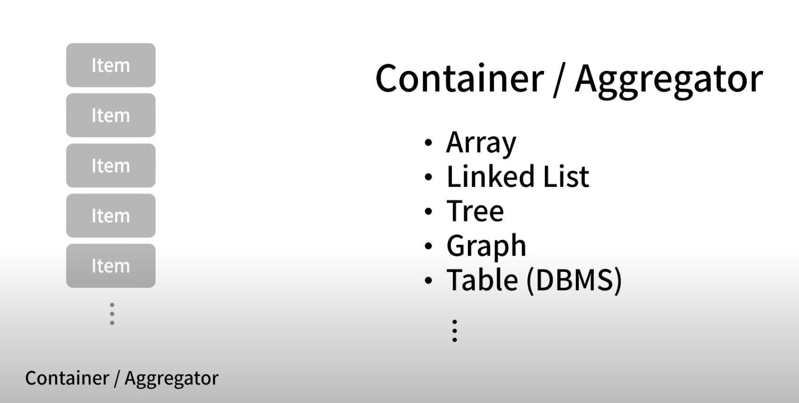
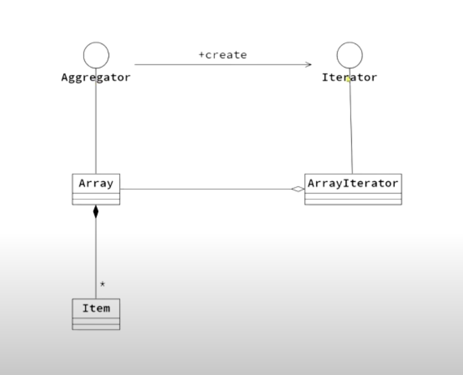

반복자(Iterator) 패턴은 일련의 데이터 집합에 대하여 "순차적인 접근"을 지원하는 패턴이다.

"이터레이터 패턴"은 각 데이터 종류에 따라 순회하는 알고리즘 전략을 정의하는 것을 말한다.

컬렉션 객체 안에 들어있는 모든 원소들에 대한 접근 방식이 공통화 되어있다면 어떤 종류의 컬렉션에서도 이터레이터만 뽑아내면 여러 전략으로 순회가 가능하다. 또한 이터레이터 패턴은 이터레이터 객체를 반환 받아 이를 이용해 순회하기 때문에 "집합체의 내부 구조를 노출하지 않고" 순회 할 수 있다는 장점도 있다.

강좌 출처: "https://www.youtube.com/watch?v=T3sXKtlr0Ow&list=PLe6NQuuFBu7FhPfxkjDd2cWnTy2y_w_jZ&index=3"

동일한 형태의 데이터를 여러개 가지고 있는 것을 "Container" 혹은 "Aggregator"라고 한다.

"Aggregator"의 종류에는 Array, Linked List, Tree, Graph, Table등이 있다.

"Aggregator"의 구성 데이터를 하나씩 가져와야할 때, "Aggregator"의 종류에 따라 방법이 다를 수 밖에 없는다. "Aggregator"의 내부 자료구조가 모두 다르기 때문이다.

예를 들어 배열의 경우 index를 통해 데이터를 가져올 수 있고, Linked List의 경우는 첫번째 데이터를 통해서 다음으로 연결된 데이터를 가져온다.

그래서 "Aggregator"의 구성 데이터를 얻는 방법이 "Aggregator"의 종류에 따라 다르니 이를 "통일된" 하나의 방법으로 가져오는 패턴이 
"Iterator"패턴이다.

"Iterator Pattern" 관점에서
"Aggregator" 인터페이스와 "Iterator"인터페이스는 "Aggregator"의 구성데이터를 하나씩 가져올 수 있는 통일된 인터페이스이다.

"ArrayIterator"클래스는 "Iterator Pattern"을 적용하기 위해 "Aggregator"의 종류 중 "배열(Array)"이라는 자료구조에 특화된 클래스이다.

