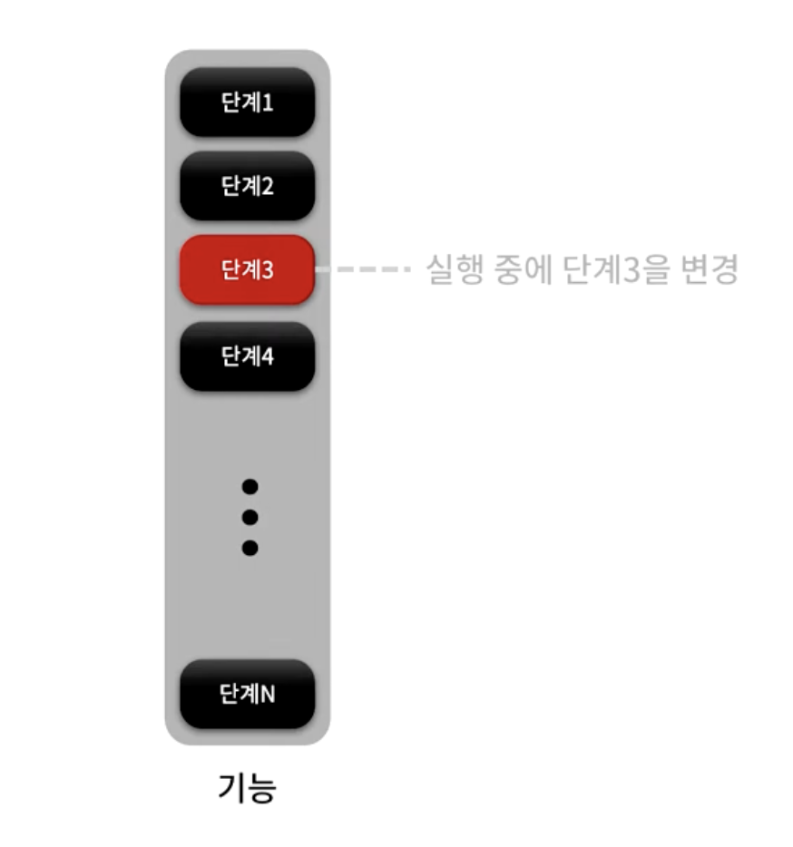
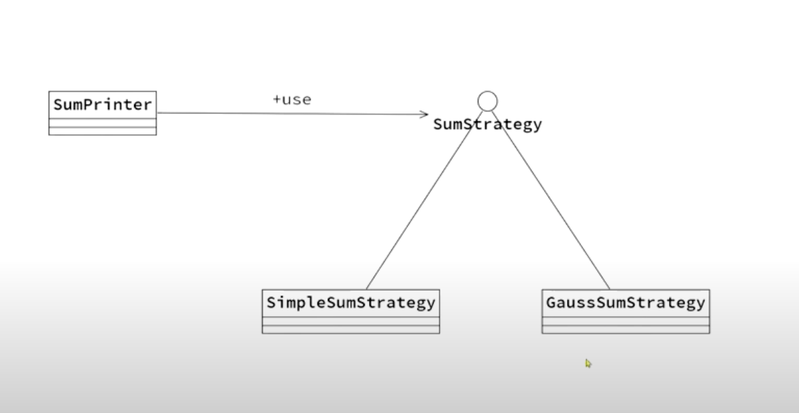

가장 단순한 패턴이다.

어떤 하나의 기능을 구성하는 특정 부분을 실행중에 다른 것으로 효과적으로 바꿀 수 있는 방안이다.

단계 1,2,3,,, 이 존재하는데 중간에 있는 단계 3을 바꾸려고 할 때, "Strategy" 패턴을 사용할 수 있다.

"SumPrinter"는 1부터 N까지의 총합을 출력해주는 클래스
총합은 "SumStrategy" 인터페이스를 통해서 얻어온다.
총합을 구하는 구체적인 코드는 "SumStrategy"를 구현한 "SimpleSumStrategy"와 "GaussSumStrategy"에 있다.

이때 "SumPrinter" 클래스는 "SumStrategy" 인터페이스만을 알 뿐 "실제 총합을 계산"하는 "SimpleSumStrategy"와 "GaussSumStrategy"는 모른다.

이로인해서 추후에 총합을 계산하는 다른 방법이 추가될 때 "SumPrinter"를 수정할일이 전혀 없다.

